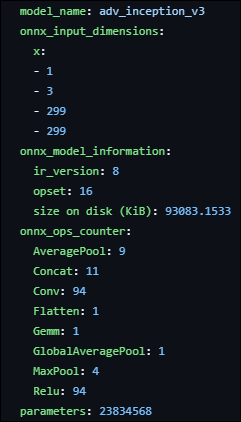
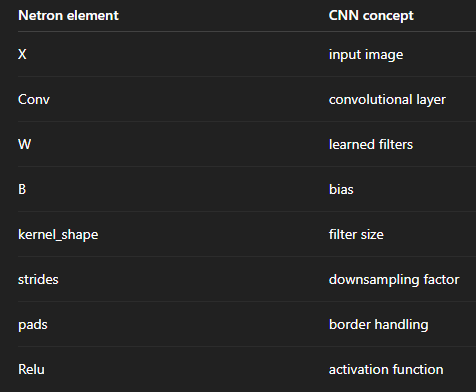
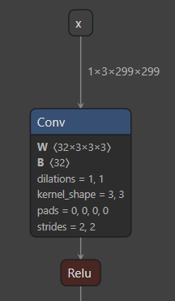
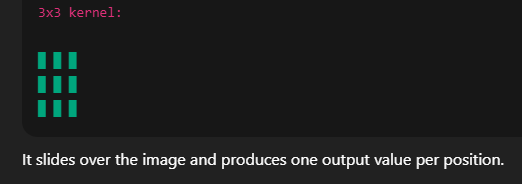
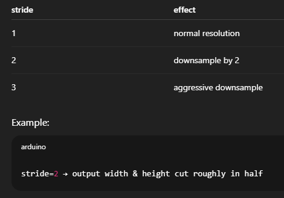
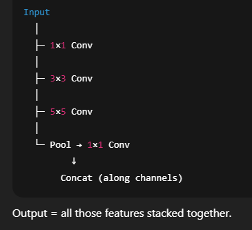
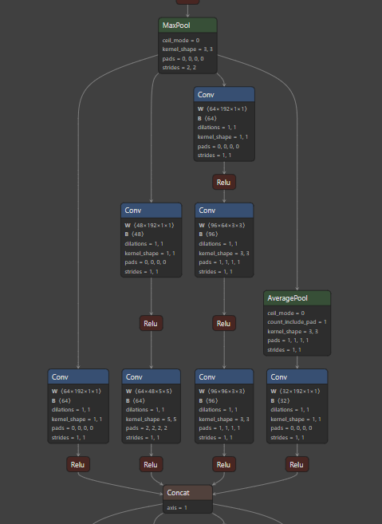
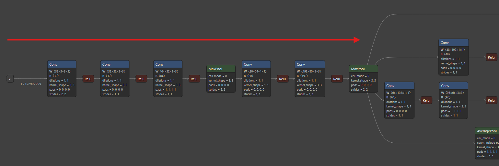
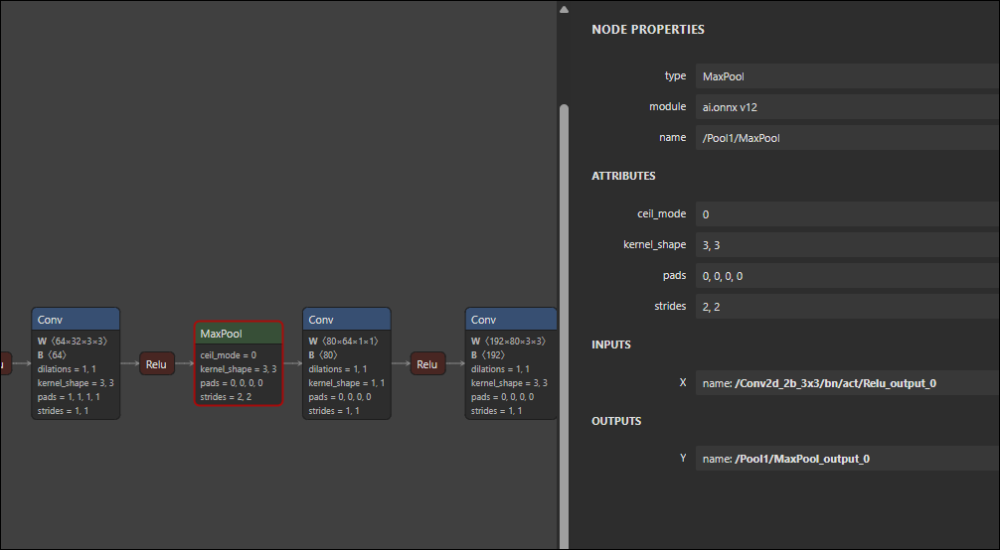
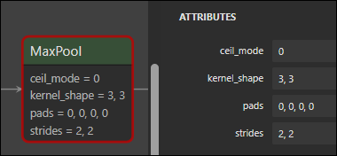

# DAG Analysis: ADV Inception-v3 Vision Model

This is an analysis of an Inception-v3 vision model that has been trained with adversarial examples.

**Source:** [adv_inception_v3_Opset16.onnx](https://github.com/onnx/models/blob/main/Computer_Vision/adv_inception_v3_Opset16_timm/adv_inception_v3_Opset16.onnx)

**Date:** 1.18.26
**Date Update:** 4.13.26

---

The model metadata `.yaml` has some useful information about the input, size, ops counter, and number of parameters.



## Data Flow Overview

The following is a general overview of the flow and layers of the Inception model.

```
Input image
    ↓
Stem (Conv + Pool stack)
    ↓
Inception blocks (many times)
  ┌─ Conv → Conv ─┐
  Input ──────┼─ Conv ────────┼─ Concat → output
  ├─ Conv → Conv ─┤
  └─ Pool → Conv ─┘
    ↓
Global average pool
    ↓
Fully connected / logits

```

## Summary of Elements

Some of the Netron and NN elements we encounter in this analysis.



## Input and 1st Layer

Model Input = batch size 1, channels 3 (RGB), height 299, width 299 (`1x3x299x299`)

This is one 299×299 color image, the standard Inception-v3 input size.

Netron labels it as `X`, but semantically this is the `input_image`.



### 1st Convolutional Layer

**Conv**

W (32 filters, each filter is 3×3, operating on 3 input channels (RGB)). This layer extracts 32 kinds of low-level features (edges, corners, color transitions) from the image while shrinking its spatial size. The strides = 2, 2 attribute is what moves the filter 2 pixels at a time across the input.

Its input was `1x3x299x299` and because stride 2 downsamples, the output will be `1,32,149,149`.

The weight Tensor `W(32x3x3x3)` represents: `[out_channels, in_channels, kernel_h, kernel_w]` — so 32 output feature maps, each looks at all 3 RGB channels using a 3×3 window.

**kernel_shape** — filter size e.g. `[3,3]`, or `[1,1]`. `[1,1]` looks at a single pixel, `[3,3]` is a standard local pattern detector, and `[5,5]` is a larger spatial pattern.

So this means: use 3×3 kernel filters, move 2 pixels at a time, and don't pad the edges of the shape.

This is an example `[3,3]` kernel filter that produces one output value per window it slides over.



**Stride** = how many pixels the kernel jumps each step.



## Inception Block/Module

An inception module is a multi-path feature extractor block. Instead of doing one convolution, it does several different ones in parallel, then merges the results. Different kernel sizes see different things — small kernels see fine details like edges/textures, while large kernels see bigger shapes like parts/objects. **Inception TL;DR: "Let's look at the same image in different ways."**

How to identify an inception block:

1 tensor in and 3–4 parallel paths, multiple Conv stacks, then one big Concat node.



This is what an inception block looks like in Netron. One tensor feeding into multiple Conv chains, one pooling chain, then a big Concat (`axis=1`). This entire subgraph is the Inception Module.



Each Conv, ReLU, Pool, Concat modifies:

- magnitude
- direction
- spatial structure
- channel coupling

**This is what attackers exploit.**

## Model Stem

The section of Conv layers prior to the Inception module is called **the Stem** of Inception-v3. Its purpose is to rapidly reduce image size, increase channel depth, and extract primitive visual features.

For each Conv node think: **"Take these feature maps, slide these filters of this size with this stride, produce this many new feature maps."**



## MaxPool

Looking at the MaxPool node below we see the following node properties:

- **kernel_shape** = `(3, 3)`
- **stride** = `(2, 2)`
- **pads** = `(0, 0, 0, 0)`
- **ceil_mode** = `0`

This means: For every channel independently, the layer slides a 3×3 window across the feature map, moves it 2 pixels at a time, and outputs the **maximum value** in each window. So spatial size is reduced roughly by half. In graph terms, MaxPool is a **many-to-one spatial aggregation node.** It collapses a small neighborhood of activations into a single value per channel. You can think of it as:

- Throwing away exact pixel positions
- Keeping only the strongest local response

Models use MaxPool for **downsampling** (reduce spatial resolution, saves compute, increase receptive field of later layers) and **local invariance** (small shifts in input don't change output much — only the strongest feature in each region survives).

### MaxPool Node & Attributes



Looking at this module more closely we see an attribute **ceil_mode** that controls **how the output size of the pooling layer is computed when the window does not fit perfectly at the edge of the feature map**. It only affects **shape calculation**, not the pooling values themselves.



For example, when sliding a pooling window (here 3×3 with stride 2), the layer must decide: "If the window would partially hang off the edge, do we stop early or include one more step?" That decision is controlled by `ceil_mode`.

### Two Cases for ceil_mode

**ceil_mode = 0** — Use floor division (default behavior). Meaning: only include windows that fully fit inside the input. The output size is:

```output = floor((input_size + 2·pad − kernel_size) / stride) + 1```

This drops border regions that don't fit cleanly, yields a slightly smaller output and more predictable geometry, and is the most common choice.

**ceil_mode = 1** — Use ceiling division. Meaning: allow one extra pooling step even if the window partially exceeds the input boundary. The output size is:

```output = ceil((input_size + 2·pad − kernel_size) / stride) + 1```

This keeps more border information, yields a slightly larger output, and sometimes requires implicit padding. Note that frameworks differ slightly in how they handle the final window at the boundary (e.g., PyTorch requires the last window to start inside the input), so the exact behavior can vary. It's best to consult the ONNX MaxPool spec for the authoritative rule. TL;DR ceil_mode decides whether pooling rounds output size down or up.


